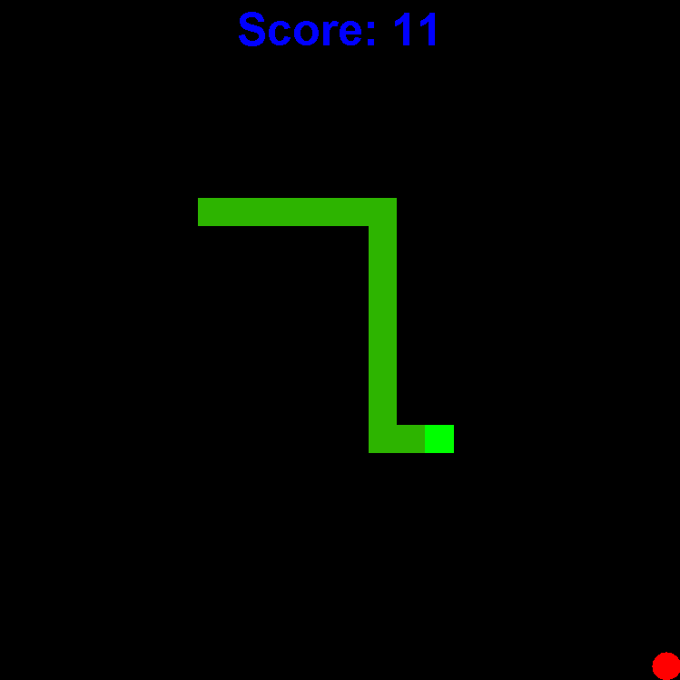
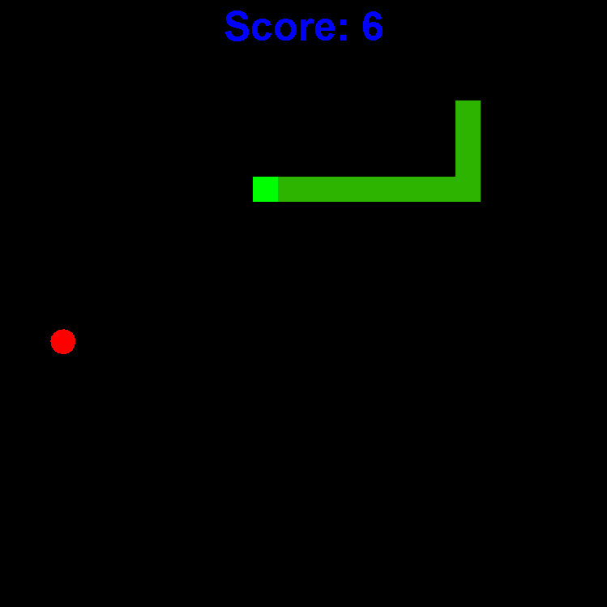
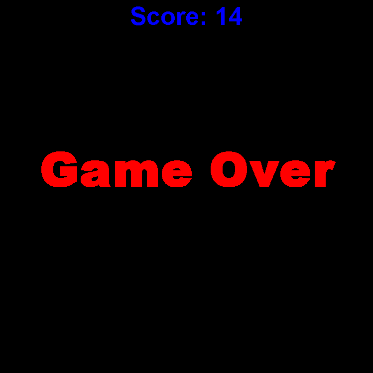

# Java Snake Game

This project is a simple snake game developed in the Java programming language. The main objective of the game is to control the snake, eat apples, and increase the score.

## How to Play?

- Use arrow keys for snake movement: Up (↑), Down (↓), Left (←), Right (→).
- Increase your score by eating apples.
- Keep the game going without colliding with the snake itself or the screen boundaries.

## Installation

1. Install Java on your computer: [Java Download Page](https://www.java.com/en/download/)
2. Download or clone the project to your computer.
3. Open the project using a Java Integrated Development Environment (IDE).
4. Run the `main` method in the `SnakeGame.java` file to start the game.

## Technologies Used

- Java
- Swing Library

## Screenshots

## Contributing

- To report bugs or make suggestions, open an [issue](https://github.com/kuzeymertcan/Java-Snake-Game/issues).
- To contribute by forking and creating a pull request, follow the [pull request guidelines](https://github.com/kuzeymertcan/Java-Snake-Game/pulls).

## License

This project is licensed under the [MIT License](LICENSE).
